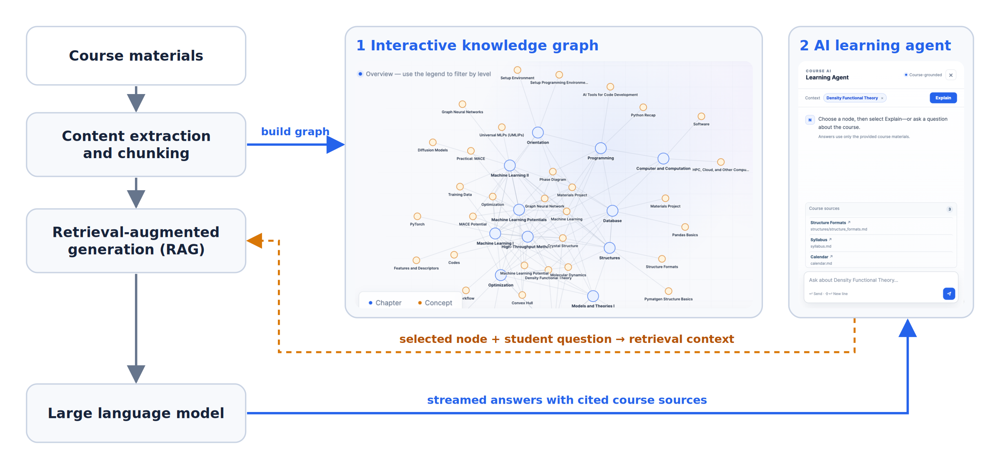
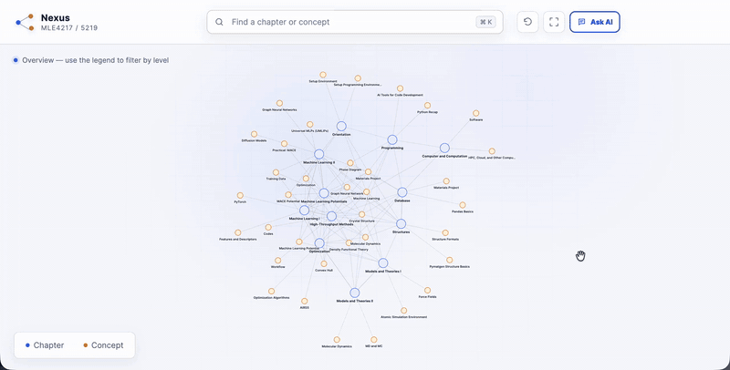
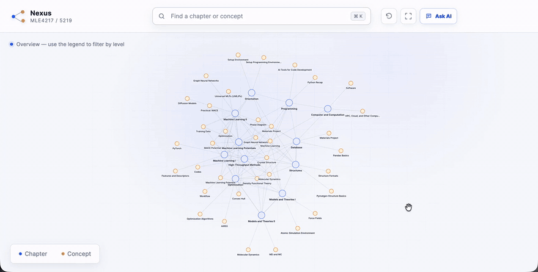

<p align="center">
  <a href="https://github.com/deng-group/Nexus"></a>
</p>

<p align="center">
  <a href="https://mle4217-5219.matsci.dev/"></a>
  
  
  
</p>

Nexus turns your course materials into two things for students:

- an **interactive knowledge graph** of the course's chapters and concepts, and
- an **AI learning agent** that answers questions using only the course materials, with a link to the page each answer came from.

It was built for the NUS course [MLE4217/5219 Materials Informatics](https://mle4217-5219.matsci.dev/), and this repository uses
that course as its example. Nothing in the code is tied to that course, so you can run it on any course written as Markdown pages
and Jupyter notebooks.

More docs: [developer notes](README_DEVELOPERS.md) · [student guide](README_STUDENTS.md) · [product plan](nexus/PROJECT_PLAN.md)

## How it works

<p align="center">
  
</p>

1. **Extract.** Nexus reads your course pages and notebooks and splits them into small pieces called chunks.
2. **Knowledge graph.** Chapters and concepts become nodes. Two nodes are linked only when they appear together in the course.
3. **Search.** When a student asks a question, Nexus finds the most relevant chunks. It combines keyword search with meaning-based search.
   If the chunks don't really answer the question, Nexus says so instead of guessing.
4. **Answer.** The chunks it found are sent to a language model (Claude, GPT, Gemini, or a local model), which writes the answer.
   No model training or GPU is needed.

## Demo

### Knowledge graph

Blue nodes are chapters and orange nodes are concepts. Click a chapter to see its concepts, or click a concept to see every chapter
that uses it. You can also filter with the legend or search.

<p align="center">
  
</p>

<p align="center"><sub>Full-resolution video: <a href="docs/assets/demo/knowledge_graph_demo.mp4">knowledge_graph_demo.mp4</a></sub></p>

### AI learning agent

Select a node and press **Explain**, or pick one of the suggested questions. You can ask follow-up questions and open the cited
course page from the answer. If the course doesn't cover a question, the agent tells you.

<p align="center">
  
</p>

<p align="center"><sub>Full-resolution video: <a href="docs/assets/demo/ai_learning_agent_demo.mp4">ai_learning_agent_demo.mp4</a></sub></p>

## Why use it

**Students** can explore the course in any order, see how topics connect, and check their understanding. The agent only answers
from the course, and it says clearly when it can't.

**Instructors** can reuse Nexus for their own course. You only need your course content and a list of concepts. Only the chunks
relevant to each question are sent to the model, and any major model provider works. Test questions let you check what the agent
will and won't answer before students use it.

## Install

You need Python 3.10 or newer and `curl`. We recommend installing with [uv](https://docs.astral.sh/uv/):

```bash
git clone https://github.com/deng-group/Nexus.git
cd Nexus
uv sync --all-extras
source .venv/bin/activate
```

Or with plain pip:

```bash
python -m venv .venv && source .venv/bin/activate
pip install -e ".[ingest]"
```

Run all the commands below from the repository root.

## Quick start

The example course is already built and included, so you only need to connect a model (see [Connect a model](#4-connect-a-model)):

```bash
cp scripts/api_env.example.sh scripts/api_env.sh   # then add your API key
source scripts/api_env.sh
./scripts/start_nexus_test.sh
```

This checks your API key, starts Nexus at http://127.0.0.1:5057/, and opens it in your browser. Press `Ctrl+C` to stop.

## Use Nexus for your own course

### 1. Extract your course

Your course should be a folder of Markdown (or MyST) pages and Jupyter notebooks, such as a Jupyter Book. Each top-level folder
becomes a chapter.

```bash
python backend/scripts/phase_a/extract_content.py --repo /path/to/your_course --output data/phase_a/course_chunks.jsonl
```

Use `--exclude` to skip files, or `--toc-only` to only read the pages listed in `myst.yml`.

### 2. Build the knowledge graph

First, list the concepts you want in the graph in `nexus/graph/concept_taxonomy.json`. For each concept, give the words to look
for in the course text:

```json
{"id": "convex-hull", "label": "Convex Hull", "category": "high-throughput", "aliases": ["convex hull", "convex hulls"]}
```

Then build the graph and check it:

```bash
python nexus/graph/build_graph.py      # writes nexus/data/course_graph.json
python nexus/graph/validate_graph.py
```

A few things you may want to change for your course:

- Chapter names and their order are set in `CHAPTER_ORDER` and `CHAPTER_METADATA` at the top of `nexus/graph/build_graph.py`.
  Chapters that aren't listed there still appear, named after their folder.
- Very common concepts, such as `python`, are listed in `BRIDGE_STOP_CONCEPTS` in the same file. They stay in the graph, but they
  don't link chapters to each other on their own.
- `validate_graph.py` includes a few checks written for the example course, such as expecting at least 10 chapters. Change or
  remove them if they don't fit your course.

### 3. Build the search index

Run any question once. The first run downloads the search model and builds the index in `backend/indexes/`:

```bash
rm -f backend/indexes/embeddings_*.npz    # delete the old index whenever you re-extract the course
python backend/scripts/query.py "What is convex hull?"
```

This prints the chunks it found and whether it thinks the question can be answered, without calling a model. Use it to check the
search results before you connect a model. To tune the results for your course, add spelling variants or course-specific words to
`TERM_ALIASES` and `LOGISTICS_TERMS` in `backend/app/retriever.py`.

To test a whole set of questions, edit `test/eval_set.json` and run `python backend/scripts/evaluate.py`.

### 4. Connect a model

Nexus works with three kinds of API. Choose one and fill in its block in `scripts/api_env.sh`:

| Provider | Works with | Settings |
| --- | --- | --- |
| `anthropic` | Anthropic (Claude), or any server that uses the same API | `ANTHROPIC_BASE_URL`, `ANTHROPIC_MODEL`, `ANTHROPIC_AUTH_TOKEN` |
| `openai` | OpenAI, or any OpenAI-compatible server, such as DeepSeek, OpenRouter, vLLM, Ollama, or LM Studio | `OPENAI_BASE_URL`, `OPENAI_MODEL`, `OPENAI_API_KEY` |
| `gemini` | Google Gemini | `GEMINI_MODEL`, `GEMINI_API_KEY` |

For example, to use a local model with [Ollama](https://ollama.com/), which doesn't need a key:

```bash
export LLM_PROVIDER="openai"
export OPENAI_BASE_URL="http://localhost:11434/v1"
export OPENAI_MODEL="llama3.1"
```

Then load the settings and test them:

```bash
source scripts/api_env.sh
python backend/scripts/check_api.py      # sends one small test request
python backend/scripts/answer.py "How is Materials Project data used to train MACE potentials?" --provider openai
```

A small, cheap model is usually enough, because Nexus gives it the relevant course text.

Answers use a temperature of 0.2 by default. Change it with `LLM_TEMPERATURE`. Some models, such as OpenAI's reasoning models,
don't accept a temperature at all; for those, set `LLM_TEMPERATURE=none`.

You can also put the same settings in a `.env` file in the repository root instead. Both `.env` and `scripts/api_env.sh` are
ignored by git, so your keys won't be committed.

### 5. Run it

Set `COURSE_SITE_BASE` in `nexus/app.py`, and the default link in `nexus/dist/app.js`, to your course website's address, so that
source links open the right page. Then start
Nexus with `./scripts/start_nexus_test.sh`.

To put Nexus on a server, see [`deploy/DEPLOYMENT.md`](deploy/DEPLOYMENT.md). To add the agent to your course website as a chat
widget, see [`README_DEVELOPERS.md`](README_DEVELOPERS.md).

## Testing

```bash
python -m unittest discover -s test -p 'test_*.py'   # unit tests
python backend/scripts/evaluate.py                   # search quality, no model needed
python backend/scripts/evaluate_llm.py               # prompts and citations, no model needed
python backend/scripts/evaluate_llm_real.py          # real answers from a model (uses your API credits)
```

Reports are saved in `test/`. See [`test/README.md`](test/README.md) for details.

## Repository layout

| Folder | What's in it |
| --- | --- |
| `backend/app/` | Search, answer checks, prompts, and model providers |
| `backend/scripts/` | Command-line tools for extraction, questions, and tests |
| `nexus/` | The Nexus web app and the knowledge graph builder |
| `web_app/` | The chat widget for the course website |
| `data/phase_a/` | Extracted chunks for the example course |
| `test/` | Tests, test questions, and reports |
| `deploy/` | Server setup files |
| `docs/` | Figures, logo, and demo videos |

## Citation

Nexus is developed by the [Deng group](https://github.com/deng-group) in the Department of Materials Science and Engineering at the
National University of Singapore, for MLE4217/5219 Materials Informatics. If you use Nexus or adapt it for your own course, please
cite this repository:

```bibtex
@software{nexus2026,
  author = {Deng, Zeyu and contributors},
  title  = {Nexus: an interactive course knowledge graph and AI learning agent},
  year   = {2026},
  url    = {https://github.com/deng-group/Nexus}
}
```
